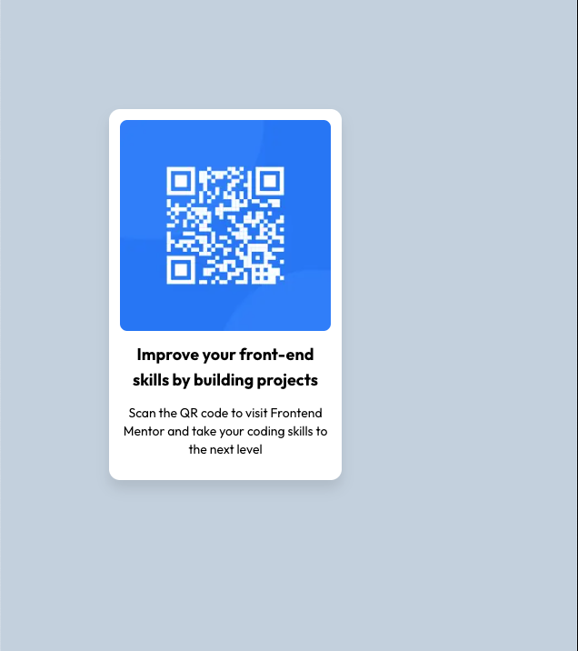

# Frontend Mentor - QR code component solution

This is a solution to the [QR code component challenge on Frontend Mentor](https://www.frontendmentor.io/challenges/qr-code-component-iux_sIO_H). Frontend Mentor challenges help you improve your coding skills by building realistic projects. 

## Table of contents

- [Overview](#overview)
  - [Screenshot](#screenshot)
  - [Links](#links)
- [My process](#my-process)
  - [Built with](#built-with)
  - [What I learned](#what-i-learned)
  - [Continued development](#continued-development)
  - [Useful resources](#useful-resources)
- [Author](#author)
- [Acknowledgments](#acknowledgments)

## Overview
Backend engineer suffering in frontend :D

### Screenshot
Initial version before peeking other solutions:

### Links

- Solution URL: [Add solution URL here](https://your-solution-url.com)
- Live Site URL: [Add live site URL here](https://your-live-site-url.com)

## My process
I started installing NextJS with the TailwindCSS setup.
Then, tried to create the default structure without CSS, only the image, title and paragraph.
With that in place, I started to try to Google things like "How to add background with TailwindCSS", "How to add border with TailwindCSS". I kept this process until have an "okish" version.

### Built with

- Semantic HTML5 markup
- CSS custom properties
- Flexbox
- [React](https://reactjs.org/) - JS library
- [Next.js](https://nextjs.org/) - React framework
- [TailwindCSS](https://tailwindcss.com/) - For styles

### What I learned

With this project I learned:
- Basic tailwind classes
- Next Image usage
- Next Font usage
- Interpolate classes from tailwind and fonts 

### Continued development

I will now check solutions from others to see what else I can improve in the solution to be more like the expected design.

## Author

- Github - [Fredy Gadotti](https://github.com/fredy-gadotti)
- Frontend Mentor - [@yourusername](https://www.frontendmentor.io/profile/fredy-gadotti)
